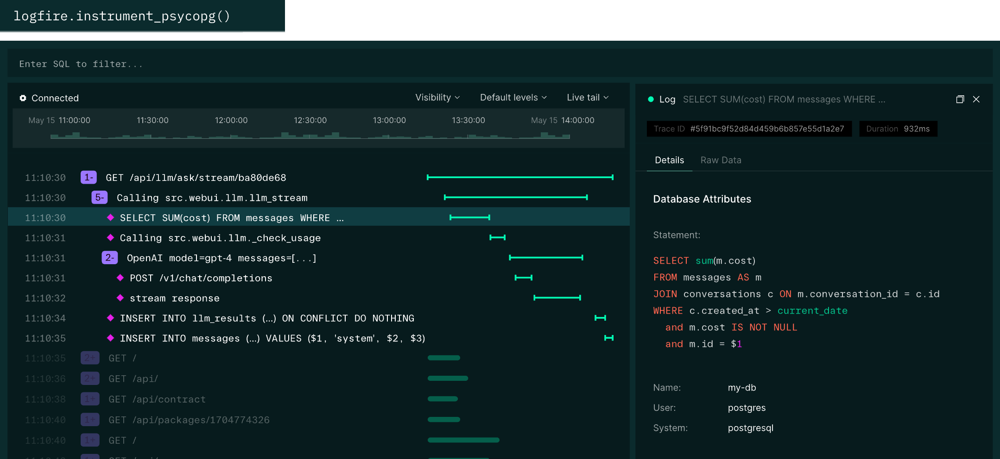

# What is Logfire?

Logfire is a new type of observability platform that empowers developers to understand their applications like never before.

From the team behind Pydantic, Logfire is an observability platform built on the same belief as our open source library — that the most powerful tools can be easy to use.

## Key Logfire Information

- [Platform](https://logfire.pydantic.dev/)
- [Why Logfire?](https://logfire.pydantic.dev/docs/why/)
- [Documentation](https://logfire.pydantic.dev/docs/)
- [Pricing](https://pydantic.dev/pricing)
- [Get In Touch](https://pydantic.dev/contact)
- [Open Source Work](https://pydantic.dev/opensource)
- [PydanticAI](https://ai.pydantic.dev/)
- [Funding](https://pydantic.dev/articles/logfire-announcement)
